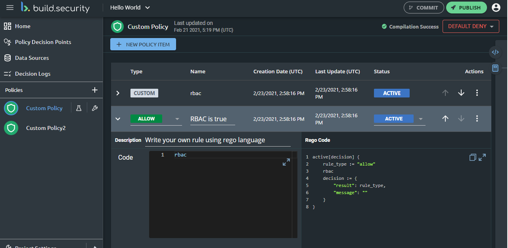
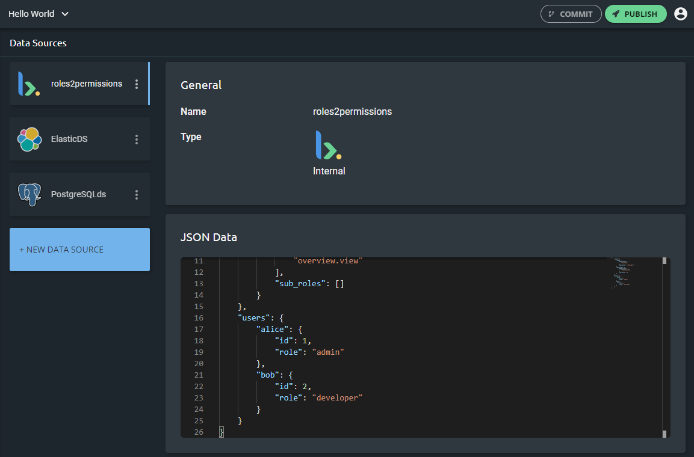

# About build.security

[build.security](https://build.security/) provides developers with a new approach to simplify the development and management of the organization's authorization policy. Using the build.security control plane, you can easily configure and manage all of the necessary components to integrate the platform with your organization to apply and monitor how you want your users to access your resources.

## Developer to Developer, Lightweight, User-Friendly, and Scalable

build.security’s policy engines are lightweight and designed with performance and scalability in mind. The user interface, especially its ability to function as a single point for creating and managing access policies, is both easy-to-use and completely unique. The platform, built by developers for developers, enables lightning-speed application RBAC and ABAC with fine-grained access controls and decoupled logic.

build.security’s authorization policy management platform takes minutes to integrate and deploy. The platform offers a hybrid solution for developers that enables them to run sidecar containers in either their development or production environments, hook them into their application with SDKs or proxy plugins, and immediately get started with a managed cloud offering for authorization management, visibility and reporting.

## Leverages OPA and the Power of Open-Sourcing

Leveraging the [Open Policy Agent](https://www.openpolicyagent.org/) project and the power of open-sourcing, build.security uses API-based data sources to inform enterprise-grade access controls across application portfolios. With build.security, development teams can ensure that their applications meet critical standards and compliance requirements in just a matter of minutes.

## External Data Sources in Real-Time

Recognizing that every application must account for its own unique set of authorization rules, build.security offers a catalog of data source connectors to further shorten development cycles. The platform architecture leverages optional caching mechanisms to avoid performance impact.

build.security allows organizations to bring information from external data sources to the policy engine in **real-time**. Current external data-source integrations include PostgreSQL, Elasticsearch, DynamoDB and MySQL. 

Additional integrations are already planned for ticketing systems such as JIRA and ServiceNow, and source code repositories such as git and Bitbucket, and more. This means that developers can now leverage information from all the above-mentioned data sources in their policy decisions with just a few clicks.

## Key Features

The platform’s key features include:

* A unified "single pane of glass" approach enables developers to easily [author](../policies/policy-items/managing-policy-items.md), [evaluate](../policies/policy-evaluation-playground.md), [distribute](../projects/publish-project-configuration.md) and [monitor](../impact-analysis/) policies at scale.
* Policy-as-code, allowing developers to express authorization policies with a no-code policy building process or through a low-code declarative language.
* Seamless [integrations](../data-sources/) with identity providers, databases and other API-based services.
* [Automatic policy suggestions ](../policies/creating-a-new-policy.md)based on runtime interactions between services.
* [Pre-defined, common rules](../policies/policy-items/predefined-rules-templates.md) built into the platform enables quick customization and implementation of organization's authorization policy.
* Lightweight and performance-optimized hybrid cloud / on-prem [architecture](getting-started.md).
* [Detailed decision logs](../decision-logs/) table enables you to view all decisions made by the Policy Decision Points PDP managed in the project.
* [Log shipping integration](../system-settings/log-shipping-integration.md) enables you to easily send decision log backups from the control plane to one or more databases within your organization.
* The ability to [integrate build.security with your Git repository](../project-settings/git-integration-settings.md) to enable you to treat all policies as code and reflect them in a designated Git repository to crate a proper review and approval workflow. 
* Flexibility in managing how your users login to build.security, using [build.security credentials](../logging-in/logging-in-1.md), [single sign on](../system-settings/single-sign-on.md), or [social provider authentication](../logging-in/using-social-provider-authentication.md).

