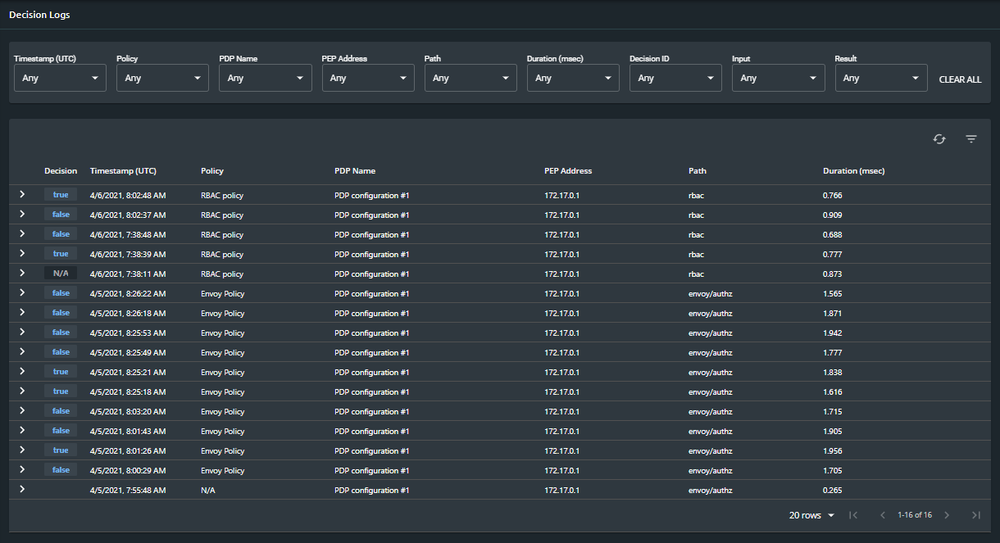

# Decision Logs

The decision logs table enables you to view all decisions made by the PDPs managed in the project. By viewing what the authorization decision was, you can analyze how effectively your authorization policy is being implemented and determine whether or not it is necessary to "tweak" the policy.

To help you find a specific decision or group of decisions, it is possible to filter the data displayed in the table by using several built-in build.security [filters](decision-log-filters.md).

### Decision Log Columns

Each line of the table includes the following information for each authorization request/response that was sent to and received from the PDPs:

<table>
  <thead>
    <tr>
      <th style="text-align:left">Filter name</th>
      <th style="text-align:left">Filter description</th>
    </tr>
  </thead>
  <tbody>
    <tr>
      <td style="text-align:left">Decision</td>
      <td style="text-align:left">
        
Displays the syntax of the decision that was made by the PDP. You can
          hover over a value in the Decision column to display the full decision
          syntax.
           
           You can click the <b>&gt;</b> arrow to expand each decision to view greater
          details about the decision. These details include:

        <ul>
          <li>Decision ID</li>
          <li>Metrics (and duration)</li>
          <li>Input</li>
          <li>Result</li>
          <li>Rule Evaluation (only visible when <a href="../impact-analysis/rule-tracing.md">Rule Tracing</a> is
            enabled)</li>
        </ul>
        
For more information on the expanded decision view, see <a href="https://docs.build.security/docs/decision-log-filters2">Decision Details</a>.

      </td>
    </tr>
    <tr>
      <td style="text-align:left">Timestamp (UTC)</td>
      <td style="text-align:left">The Timestamp (UTC) column displays the timestamp assigned to this decision.
        Format is MM/DD/YYYY, H:MM:SS AM (or PM).</td>
    </tr>
    <tr>
      <td style="text-align:left">Policy</td>
      <td style="text-align:left">Lists which policy was used in the decision process.</td>
    </tr>
    <tr>
      <td style="text-align:left">PDP Name</td>
      <td style="text-align:left">The name of the PDP, as it exists in the control plane, responsible for
        determining the authorization decision.</td>
    </tr>
    <tr>
      <td style="text-align:left">PEP Address</td>
      <td style="text-align:left">The PEP IP address to which the PDP&apos;s decision was sent for enforcement.</td>
    </tr>
    <tr>
      <td style="text-align:left">Path</td>
      <td style="text-align:left">The path used to send the policy against which the authorization request
        is evaluated.</td>
    </tr>
    <tr>
      <td style="text-align:left">Cache Hit Ratio</td>
      <td style="text-align:left">For policies that include calls to external data sources (eg. databases),
        the <em>Cache hit Ratio</em> indicates the amount of cache hits out of the
        total requests made during the evaluation of this policy.</td>
    </tr>
    <tr>
      <td style="text-align:left">Duration (msec)</td>
      <td style="text-align:left">The duration of the decision process as calculated from the request arrival
        time to the time that the PDP sends the decision result to the PEP (in
        msec).</td>
    </tr>
  </tbody>
</table>

