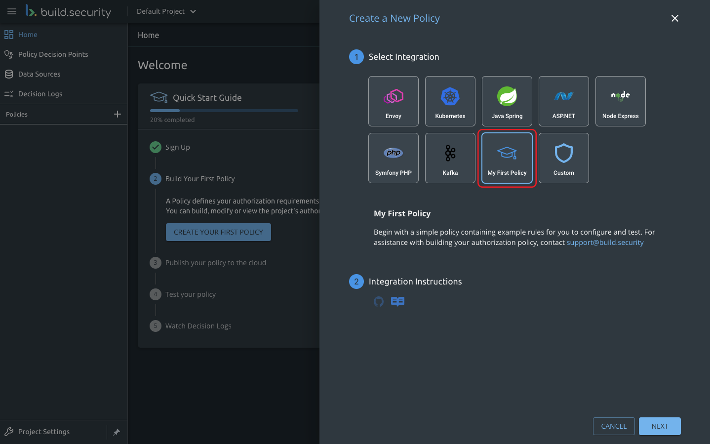
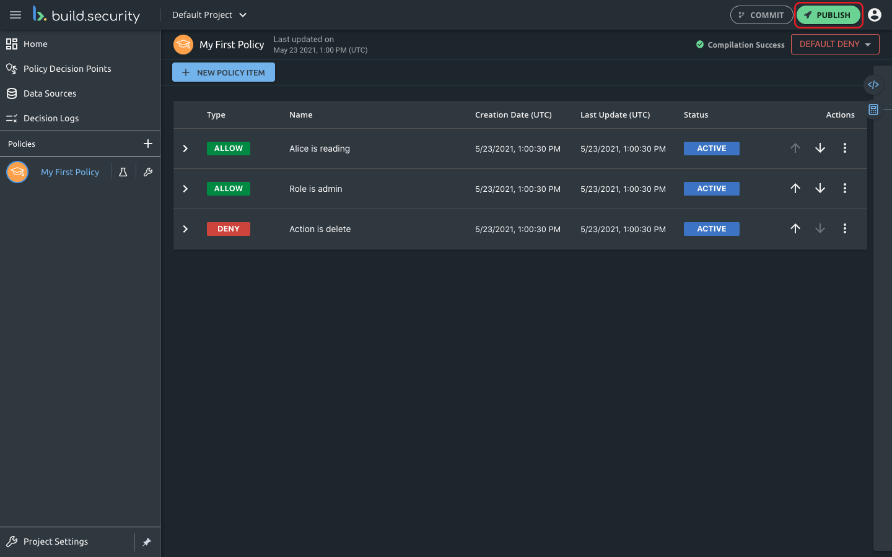
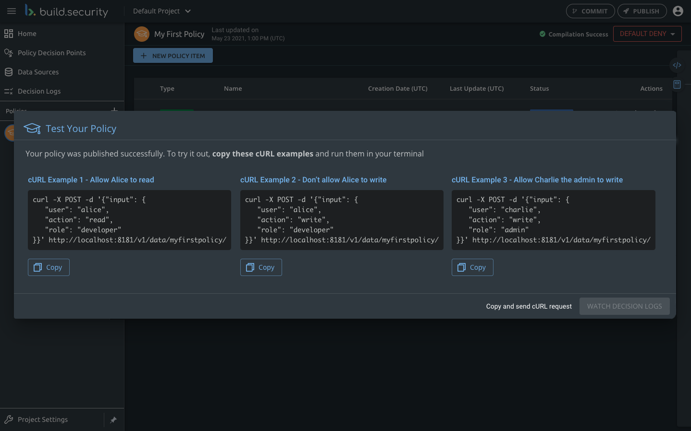
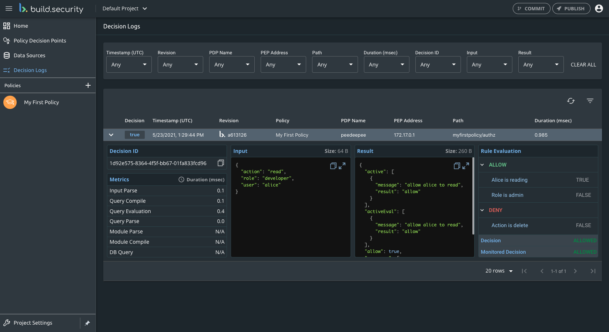

# Onboarding

Before you begin this tutorial, sign up for build.security for free. This guide will help you set up your first policy, publish it and test it.

## 



## Step 1 - Build Your First Policy

A [Policy](../policies/) defines your authorization requirements for allowing or denying users access resources. You can build, modify or view the project's authorization policies at any point.

**Create your first policy** by clicking the **+** icon in the left menu.

Select **My First Policy** to start with a few best practice rules that you can try out.

## Step 2 - Publish your policy to the cloud

Now that your first policy is ready, you can publish it to a public[ PDP](../policy-decision-points-pdp/) \(Policy Decision Point\) server on the cloud.

Publish your policy by clicking the **PUBLISH** button on the upper right in the top bar.

## Step 3 - Test your policy

Now, you can send authorization queries to your cloud PDP. We've prepared some [examples](../policy-decision-points-pdp/tls-configuration.md#validation-using-curl) for you to try out.

After publishing your policy, few **cURL examples** will appear on the screen. Copy any of the cURL examples and **run it in your command line.**

## Step 4 - Watch Decision Logs

Congrats on finishing the publishing process! To see your policy in action, go to the Decision Logs screen to see your first logs.

Click on **Decision Logs** in the left menu. Expand the entities for more information.

