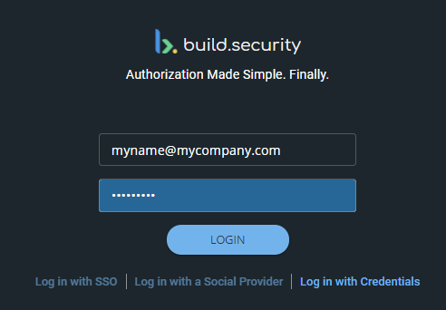

# With build.security Credentials

You can log in to the build.security control plane in several ways. For more information, see [Logging In](./).

**To log in with build.security credentials:**

1. Below the social provider links, select **Log in with Password**. The build.security credentials options will appear.
2. In the **Email** field, enter your email address.
3. In the **Password** field, enter your password.
4. Click **LOGIN**.


**Possible Errors**

If you are unable to log in, contact your administrator to reset your password or contact- [support@build.security](mailto:support@build.security).


More details on User Management can be found In [System Settings](../../system-settings/).

