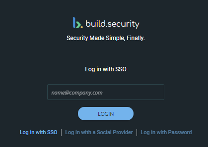

# Using Single Sign-On

Users can log in with their email address alone, when configured as a single sign-on user. Below are details for signing in. For information on how to configure the system to use single-sign on, see [Single Sign-On](../../system-settings/single-sign-on.md). 

‌**To log in using Single Sign-On:**

1. Below the social provider links, select **Log in with SSO**. The SSO login page appears.
2. Enter your email address.
3. Click **LOGIN** to confirm your credentials. The page will re-direct for authentication and then you will enter the build.security platform.

‌Note: If your organization does not require SSO login and you still select this option, an error message will appear on the login page. Return to the log in page to login correctly or contact your system admin for further assistance.

**Possible Errors**

If you are an SSO user and are unable to log in, contact your administrator to reset your password or contact [support@build.security](mailto:support@build.security).‌

More details on User Management can be found In [System Settings](https://app.gitbook.com/@build-security/s/build-security/~/drafts/-MYZ_E0L5KM7xfNKXbQW/system-settings).

