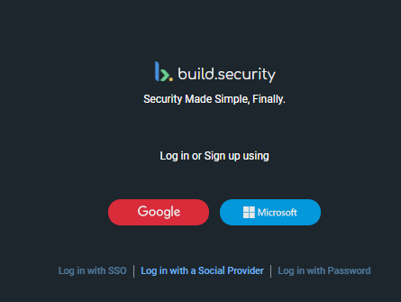

# Using Social Provider Authentication

You can log into the build.security control plane using either your **Google** account or your **Microsoft** account credentials. 

**To log in using your Google Account:**

1. Click the **Google** button on the build.security login page. 
2. A list of your current Google accounts will appear. You can either select one of these or click **Use another account** to select an account that currently does not appear as an option.
3. Depending on your Google configuration, you may be asked to verify your selection \(for example, you may be sent a verification code to your registered phone number or email\). After you enter the required code, click **Next**. 

 **To log in using your Microsoft account:**

1. Click the **Microsoft** button on the build.security login page. 
2. If your computer is already logged in with to your Microsoft account, the build.security control plane will open immediately. Otherwise, you will be asked to enter your Microsoft credentials.

The build.security control plane will appear. For more information on how to proceed, see [Getting Started](../getting-started/).

