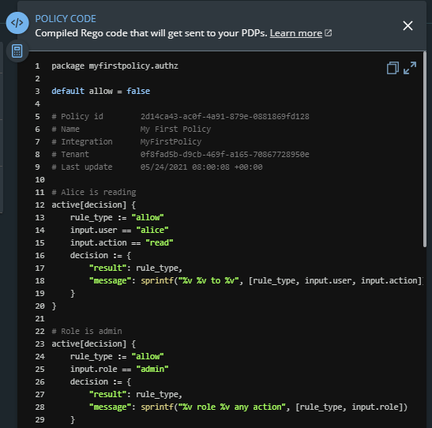

# Policy Code Panel

The policy code panel offers you the ability to view and copy the compiled Rego code that is sent to your PDP for the current policy being displayed. The panel is located in a shared space with the [Policy Evaluation Playground](policy-evaluation-playground.md) panel.

When you click on the expand icon, the Policy Code panel opens on the right side of the policies screen.

You can use the scroll bar on the right to scroll to text that is not currently visible, and you can use the Copy icon to copy all of the code to the clipboard.

### Code Error Alerts in Policy Items

When an error is detected in the code of a policy item, you will be notified in the following ways:

* Error icons will appear on the unexpanded and expanded icons of the policy code panel.


**Note**

In the lower area of the Policy code tab, an error window will appear if there is a code error identified. The line where the error exists as well as a brief explanation about the error will appear as well.


