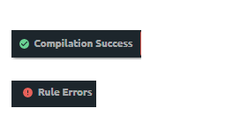

# Policy Compilation Status

As you create or edit a policy, build.security automatically compiles the update into your existing authorization policy. When you click [Publish](../projects/publish-project-configuration.md), the new policy \(or policy items and any other changes to the policy configuration\) are published to the PDP \(with the next bundle request\).

On the [policy toolbar](policies-screen/policy-toolbar.md), the policy compilation status icon can display one of the following statuses:

| Icon | Explanation |
| :--- | :--- |
| **Compiling** \(no icon\) | Whenever build.security is compiling your policy, the word "Compiling" will momentarily appear in the toolbar and be replaced by one of the following icons when compilation is completed. |
| Green check icon with **Compilation Success** | Indicating to the Policy Creator or Policy Editor that the the policy was created/edited successfully and no errors were found in any of the policy rules. |
| Red warning icon with  **Rule Errors** | Indicates an error was found in one or more of the rules. Before the policy can be applied successfully, these rules must be fixed. Beside any rule containing an error, a triangular red warning icon will appear.  |

