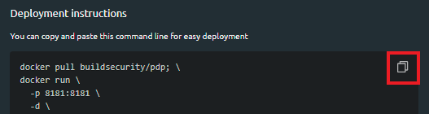
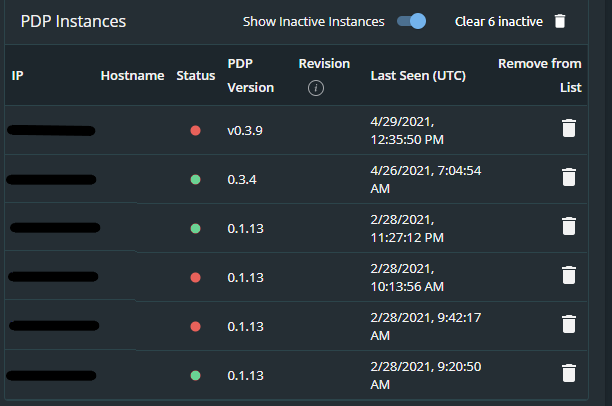

# Policy Decision Points \(PDP\)

Policy Decision Points are responsible for making authorization decisions based on the organization's authorization policy. After evaluating the authorization request against the policies created within build.security, the PDP determines whether or not access to the resource will be allowed or denied.

Within the build.security project, you can manage multiple PDP configurations. Each PDP configuration defines the necessary details to [deploy](pdp-deployments/) a PDP in your organizational environment whice pull the authorization policies that will determine the authorization decision.

When you open the PDP navigation option, all currently defined PDPs are listed in the table in the main display area.

For each PDP configuration, the following information is displayed:

<table>
  <thead>
    <tr>
      <th style="text-align:left">Field Name</th>
      <th style="text-align:left">Description</th>
    </tr>
  </thead>
  <tbody>
    <tr>
      <td style="text-align:left"><b>Name</b>
      </td>
      <td style="text-align:left">
        
Indicates the name of the PDP configuration.

        
Note that each name must be unique in the project.
           
           When you click on<b> (&gt;) </b>next to the name of a configuration, the
          view expands to offer additional details about the PDP including information
          about the API key and a list of all instances authenticated with build.security
          using this configuration API key and secret. For more information about
          what is displayed in the expanded view, see the following section.

      </td>
    </tr>
    <tr>
      <td style="text-align:left"><b>Creation Date (UTC)</b>
      </td>
      <td style="text-align:left">The date and time that the PDP was created.</td>
    </tr>
    <tr>
      <td style="text-align:left"><b>Last Update (UTC)</b>
      </td>
      <td style="text-align:left">The last time (UTC) the PDP was updated (that the name or description
        was changed).</td>
    </tr>
    <tr>
      <td style="text-align:left"><b>Actions</b>
      </td>
      <td style="text-align:left">There are three actions that can be performed for each PDP:
         <a href="editing-a-pdp-configuration.md">- Edit a PDP </a>- <a href="deleting-a-pdp.md">Delete a PDP</a>
      </td>
    </tr>
  </tbody>
</table>

### Available Actions

**On the Policy Decision Points screen, you can:**

* [Creating a new PDP configuration](creating-a-new-pdp-configuration.md)
* [Generate API keys for your PDPs](generating-api-keys-for-a-pdp.md)
* [Edit an Existing PDP](editing-a-pdp-configuration.md)
* [Delete a PDP](deleting-a-pdp.md)

### PDP Expanded View

You can also access additional information about each PDP by clicking **&gt;**. The row expands to display the following information:

#### Keys Management Section

* API key
* Creation date and last update of the API key \(in UTC\).
* Deployment instructions \(see [Deploying a build.security PDP](pdp-deployments/)\).


Use the **copy** icon to copy the deployment instructions and then paste them into the command line to deploy the PDP.


#### PDP Instances Section

* **Show Inactive Instances:** Use the toggle switch to toggle between showing or hiding inactive instances.
* **Clear &lt;\#&gt; inactive:** When you click the track icon, all inactive instances will be removed from the list. If you prefer, you can can individually delete instances using the trash icon located next to each PDP instance.
* **IP address**: the internal IP address of the machine running the configuration 
* **Hostname:** name where the PDP is hosted
* **Status:** of the connection between the PDP and the build.security control plane \(green confirms communication between the two; red indicates build.security is currently not in communication with the PDP\).
* **PDP version:** version number of the PDP instance
* **Revision:** the active bundle revision number
* **Last seen \(UTC\):** date and time build.security last connected with the PDP.
* **Remove from list:** deletes old records that are inactive. A new record will be added when the PDP authenticates with the control plane.

### PDP Use Case Example

A docker running an OPA-based Policy Decision Point \(PDP\) in your cluster gets the authorization request from your API application \(PEP\). The PDP makes the authorization decisions according to the cached policy and specific configurations received from the control plane.

Upon making the decision, the organization's PDP returns the decision to build.security and sends its decision to the PEP, which is responsible for enforcing.

Following this, based on the configuration settings, the PDP sends the authorization decision to be logged in the decision log table.

