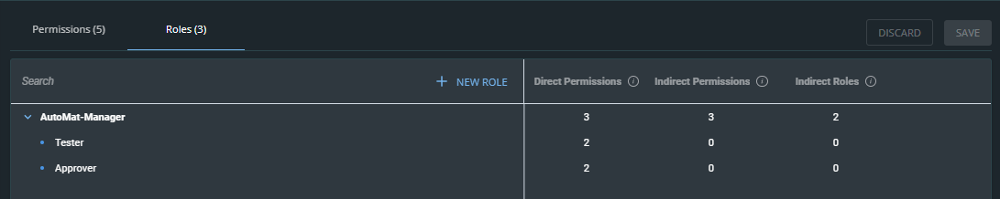
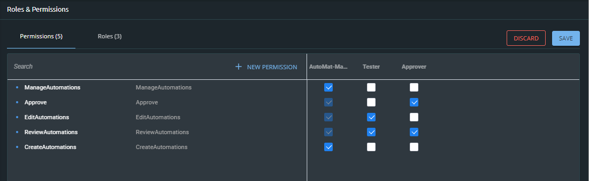

# Roles and Permissions

Using the Roles and Permissions feature, you can customize your build.security policies to express all of the nuances and requirements of your organization's authorization policy. 


**Note:** When naming a role or permission, the names can only contain: letters, digits, dashes and/or underscores.


## Roles and Permissions Example

Consider a financial organization that provides loans to its customers. The process of approving \(or denying\) each loan involves several steps. To facilitate the process, the organization has a development team responsible for creating automations which automatically implement, review and verify various parts of the loan review process. 

Within the department there are various roles, each with their own set of permissions. Roles are assigned based on one of the following actions: 

* Manage the automation process  \(AutomationManager\)
* Creating an automation \(AutomationManager\)
* Editing and/or testing an automation \(AutomationManager, Tester\)
* Review an automation \(all roles\)
* Approving the tested automation such that it becomes part of the review process \(AutomationManager, Approver\)

In build.security, the roles are created and permissions assigned in the Roles and Permissions screen. Although you can create permissions and roles independently of each other, it is recommended that you first create the roles because part of the logic in creating permissions is to map each of the permissions to the roles related to them. build.security policies can apply ALLOW or DENY to each of these permissions as part of the rules and policies you create.

#### Creating Hierarchical Roles and Permissions

You can create roles and sub-roles. When assigning a permission to a sub-role, the role to which it belongs will be granted indirect permission. 

Direct and indirect roles  and permissions are displayed on the **Roles** tab. Which roles are mapped to each permission is displayed on the **Permissions** tab.

### Creating New Roles

Roles can be created for any identity \(individual, group, entity\). In build.security, the purpose for why the role exists, naming conventions for the roles, and how these roles are applied is determined by the PDP once it receives the policy from build.security.

In building the roles, it is possible to create a hierarchical structure that will result in roles that receive permissions directly as well as roles that will receive permissions indirectly. In the above example, the AutomationManager will receive indirec

**To create a role:**

1. From the control plane menu, select **Roles and Permissions.**
2. Select the **Roles** tab.
3. Click **New Role**. A new line is added to the list of roles.
4. Enter a name for the new role.
5. Click the check mark to create the new role. 
6. When you have finished adding new roles, click **Save**.

**To create a sub-role:**


**Note:** Roles automatically inherit the permissions of their sub-roles indirectly.


1. From the control plane menu, select **Roles and Permissions.** 
2. Select the **Roles** tab.
3. Hover over the Role for which you wish to create a sub-role and click the **+** sign. A new line is added below the role.
4. Enter a name for the new sub-role.
5. Click the check mark to create a new sub-role.
6. When you have finished adding new roles, click **Save**.


**Notes:** 

* Additional hierarchical levels can be added by clicking on the role **+** sign on the level below which you wish to create a sub-role. 
* Indirect permissions are enabled automatically to roles when applied to a sub-role.


### Creating New Permissions

Permissions are created or any action that you want to allow or deny your users. It can be any standard action \(such as read, write, access, etc.\) or anything that is unique to your organization's authorization requirements \(access, block, approve, edit, etc.\)

**To create a new permission:**

1. From the control plane menu, select **Roles and Permissions.**
2. Select the **Permissions** tab**.**
3. Click **New Permission** and enter the name of the new permission.
4. To grant permission based on roles, in the right column, select the roles that will be associated to these permissions. 
5. When you have finished adding new permissions, click **Save**.

**To create sub-permissions:**

1. From the control plane menu, select **Roles and Permissions.**
2. Select the **Permissions** tab**.** 
3. Hover over the Permission below which you wish to create a sub-permission and click the **+** sign.  A new line is added below the permission.
4. Enter the name of the new sub-permission.
5. Select the roles that will be associated to this permission. 
6. When you have finished adding new permissions, click **Save**.


**Note:** Indirect permissions are enabled automatically can cannot be disabled without changing the hierarchical structure of permission.


