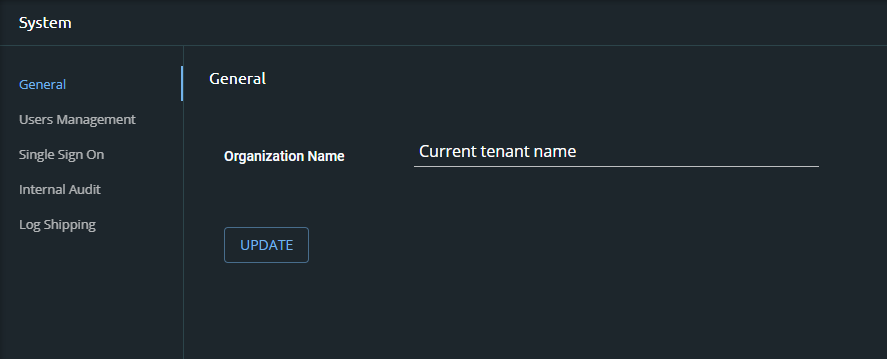

# System Settings

The System Settings option enables you to configure system-wide settings. Located at the bottom of the navigation panel, you can perform the following:

The System Settings option enables you to configure system-wide settings. Accessed by clicking the user avatar on the build.security toolbar, the system settings option opens the system screen and menu options. By default, when opening the systems settings screen the General, which include: 

| Screen | Explanation |
| :--- | :--- |
| General | Displays the current tenant name. It can be edited and updated as needed. This field is completed during the onboarding process, is visible in the audit logs, and is particularly useful for tracking projects and policies in multi-tenant organizations. |
| [User Management](managing-users/) | Displays current users \(name, email, role, etc.\) and offers access to create, modify or delete users as well as assign or change permissions \(roles\). |
| [Single Sign On](single-sign-on.md) | Enables you to configure single sign on for your users |
| [Internal Audit](internal-audit.md) | Displays the Audit logs \(timestamp and details of activity\) |
| [Log Shipping](log-shipping-integration.md) | Enables you to create log shipping integration. For more information, see [Log shipping integration](log-shipping-integration.md). |

