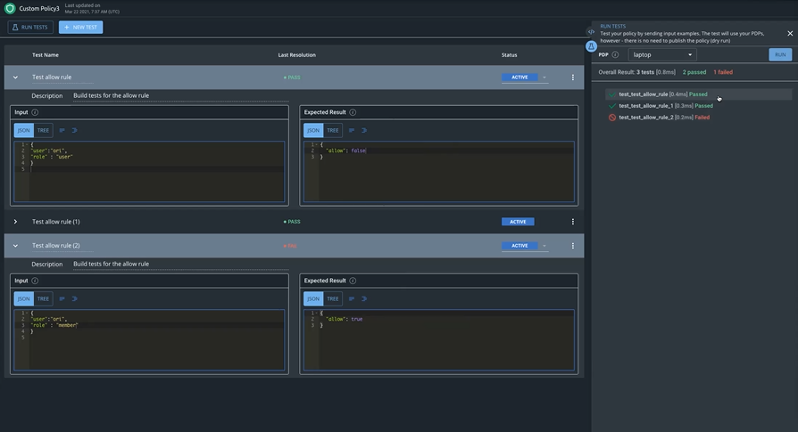

# Running a Policy Unit Test

To run a policy unit test, you can access the test screen by clicking on the test icon next to the policy name you wish to test. This will open up a list of all currently defined tests for this policy. If no tests have been created.


To run a test, you must have an online PDP instance. For more information, see [Policy Decision Points \(PDP\)](../../policy-decision-points-pdp/).


**To run a test:**

1. Click the **RUN TESTS** button. The Run Tests panel will open on the right side of the screen. 
2. In the PDP field, use the drop down menu to select the PDP you wish to use to evaluate the rule.
3. Click **RUN.**

The results of the test will appear in the Run Tests panel. For each test that was run, you will see either **Passed** or **Failed**. 

* **Passed** means that the Input you entered generated the Output you expected when the rule was evaluated by the PDP. 
* **Failed** means that the Output did not return the correct value and therefore the rule should be inspected and fixed.

