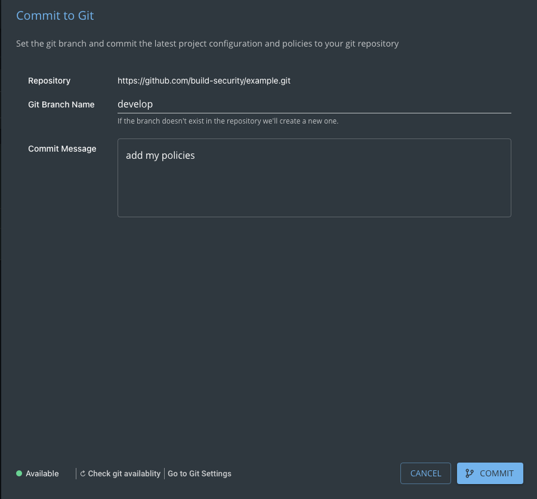
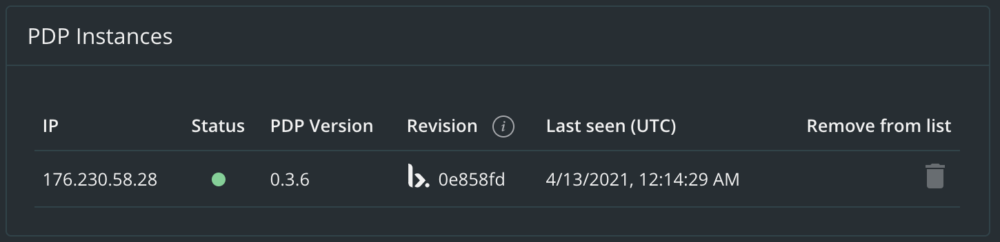
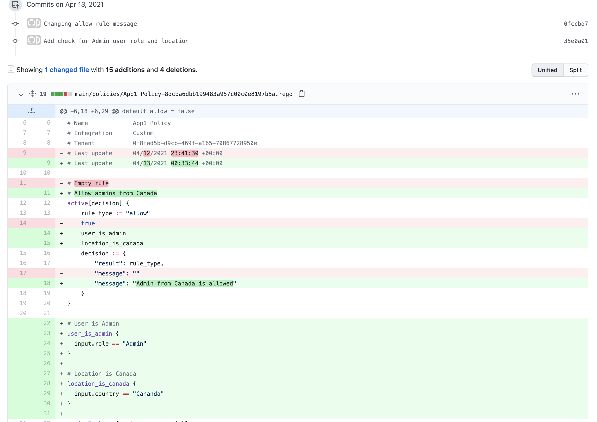
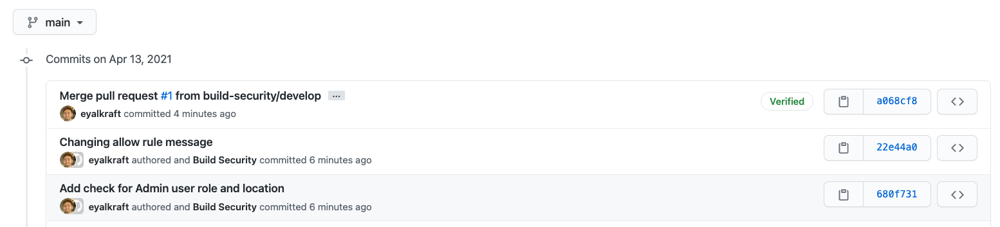
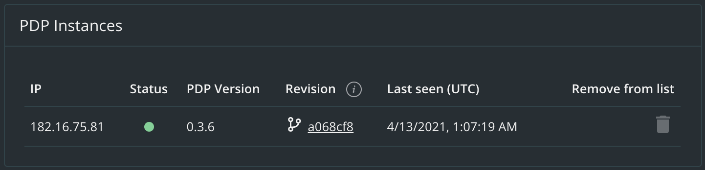
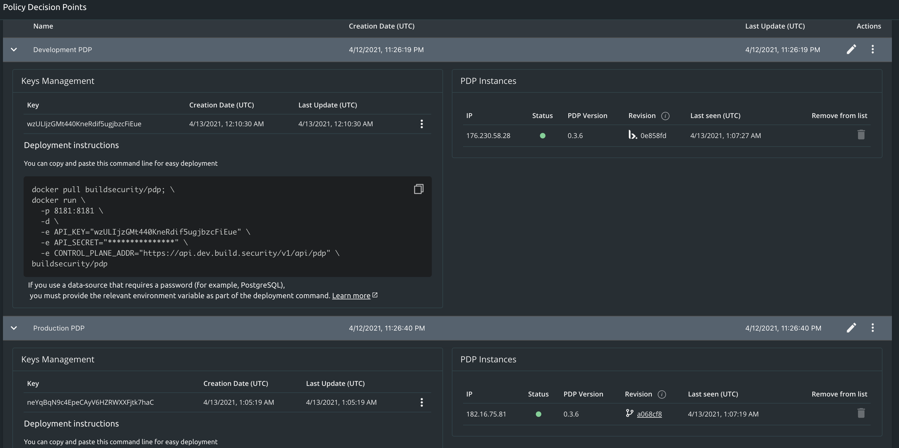

# Working with Environments \(Dev vs. Production\)

## Overview

When treating policy as code, policy rollout will be part of the Software Development Life Cycle \(SDLC\). In order to treat policies as code, we would utilize the [Git integration](../documentation/project-settings/git-integration-settings.md) feature.

The below is an example of how one might roll the defined policy to the production environment as part of the SDLC.

For simplicity, we will assume there are two environments: _development_ and _production_.

## Step \#1 - Configure the Git integration

Follow the steps in the [Git integration](../documentation/project-settings/git-integration-settings.md) page and review how to configure the directory in which the policies will be stored in the selected Git repository, and how to define the Git branch, in the [Commit Project to Git](../documentation/projects/commit-project-to-git.md) page.

## Step \#2 - Developing the policy

After we have configured the [Git integration](../documentation/project-settings/git-integration-settings.md), authoring of the policy will take place and a [commit](../documentation/projects/commit-project-to-git.md) to Git will be done.

We would like to commit our policy in the development stage to a branch which is not `main` - let us call this development branch `develop` and make sure that we commit to that branch.



## Step \#3 - Deploying a PDP for development

We will [create a new PDP](../documentation/policy-decision-points-pdp/creating-a-new-pdp-configuration.md) which we will use for development purposes - such a PDP will be deployed in our _development_ environment.

When deploying the PDPs, we may set the BUNDLE\_COMMIT environement variable \(see [PDP Deployments](../documentation/policy-decision-points-pdp/pdp-deployments/#environment-variables.md)\), but since the development phase of a policy is an interative one \(policies are constantly edited, refined, tested and published\) it can be more efficient to deploy the PDP without setting the Git SHA in the BUNDLE\_COMMIT, otherwise we will need to redploy the PDP each time with a new commit SHA to see our changes take effect.

We can still continue to commit our changes to Git when editing the policy, but we will also _Publish_ our changes to the PDPs that are not deployed with the BUNDLE\_COMMIT environment variable that holds a commit SHA.

Note that when we would _Publish_ to such a PDP, a _build.security_ logo will appear next to the Revision value - this means that the Revision is taken directly from the _build.security_ control-plane rather from Git.



We would then continue to iteratively author the policy, test it and Publish it until we are satisfied - we would then Perform a [Git commit](https://github.com/build-security/docs/tree/464feb65ba41ad416039af8c2ae4f3ad634e97a3/.gitbook/assets/commit-to-dev-branch.png) operation from the _build.security_ console to store the changes in Git.

## Step \#4 - Peer reviewing policy changes

Now that we are satisfied with our policy, we would like to have our changes approved before rolling-out the policy to production - our integration with Git will allow us to do so.

We would likely want to merge our policy to the `main` branch - we would therefore open a pull-request for our changes for merging the changes from branch `develop` to `main`. This will allow our peers to review the changes in the Rego files and approve them.



Once the pull request has been approved, we can merge it to branch `main`.

## Step \#5 - Rolling-out the policy to production

After the merge of the pull-request to branch `main`, we will have a new commit SHA that we can use for deploying the changes to production.



We can configure our GitOps processes to take the latest commit SHA on branch `main` and use it to deploy one or more PDPs in our _production_ environment - we shall do so by utilizing the [BUNDLE\_COMMIT](../documentation/policy-decision-points-pdp/pdp-deployments/#environment-variables) environment variable which will force the PDP to pull the policy bundle for this exact commit.

We shall create a new PDP configuration and call it `Production PDP`.

The deployment command for the PDP may look similarly to the following \(assuming it is deployed as a standalone PDP\):

```bash
docker pull buildsecurity/pdp;  
docker run \
 -p 8381:8181 \
 -d \
 -e BUNDLE_COMMIT="a068cf8952a599395b3e1e18f379d1d7dbd3aaee" \
 -e API_KEY="neYqBqN9c4EpeCAyV6HZRWXXFjtk7haC" \
 -e API_SECRET="CEKF***Yzo9Z1JkyfbyHHHkrvk2uy982SuvPPWq668U6TawVhXFi3sumNgWK9Vj8" \
 -e CONTROL_PLANE_ADDR="https://api.dev.build.security/v1/api/pdp" \ 
 buildsecurity/pdp
```

If we will examine our PDP instances, after the deployment of the PDP, then we will see that the Revision field now holds the commit SHA \(short form\) and next to it a Git icon.



In the Policy Decision Points page, we can see that the Development PDP configuration is using publish policies while the Production PDP configuration is using a Git commit which was taken from the `main` branch, as mentioned above.



## Summary

We have demonstrated above how one may develop policies on a development environment while not affecting the policies running in production environments.

We have also demonstrated how the Git integration feature allows us to treat policies as code and by so allow us to control the changes that are intended to reach production \(by using pull-requests\).

Finally, we proposed a method for automatic deployments \(continous deployment\) by utilizing Gitops processes for taking the latest commit SHA from a production branch \(`main` in this case\) and deploying PDPs in production using that specific commit SHA.

