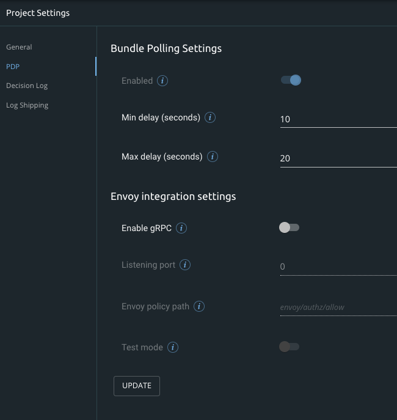

# PDP Settings

The PDP settings, located under the [Project Settings](https://docs.build.security/docs/manage-your-projects) menu, enables you to configure the basic parameters related to the PDPs that are defined in your project. These include:

* Bundle settings
* Envoy integration settings

### Bundle Settings

A bundle contains a combination of the following information:

* All the policy versions that were marked as "Ready"
* Data source details

The bundle polling settings screen enables you to configure how often the PDPs request updated bundles from build.security. However, to enable the PDP to request these bundles, you must enable the bundle polling feature and define the minimum and maximum time intervals, as detailed below.

| Parameter | Description |
| :--- | :--- |
| Bundle polling | Enable/disable bundle polling. |
| Min delay \(seconds\) | The minimum interval between times that the PDP requests a bundle from the control plane. |
| Max delay \(seconds\) | The maximum interval between times that the PDP requests a bundle from the control plane. |

### Envoy Integration Settings

The Envoy settings screen enables you to configure the build.security PDP's integration with the Envoy proxy. For more information, see [Envoy Proxy Configuration](https://docs.build.security/docs/envoy):

| Parameter | Explanation |
| :--- | :--- |
| Envoy integration enabled | Enable or disable integration with Envoy proxy. |
| Listening port | Enables you to configure the port which the PDP will listen on to receive authorization requests from Envoy proxy.  Default value of this parameter is 9191. |
| Envoy policy path | Defines the path from which the policy is loaded when the Envoy proxy queries the PDP. |
| Test mode | When enabled, the PDP log evaluates all requests but the envoy will treat all requests as allowed. |


**Reminder**

After you complete the fields, or in the future if you change any values in these fields, click **Update** to save the new settings.


