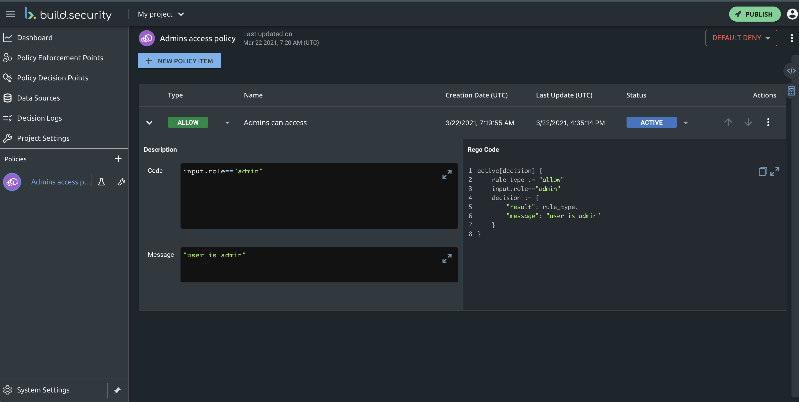
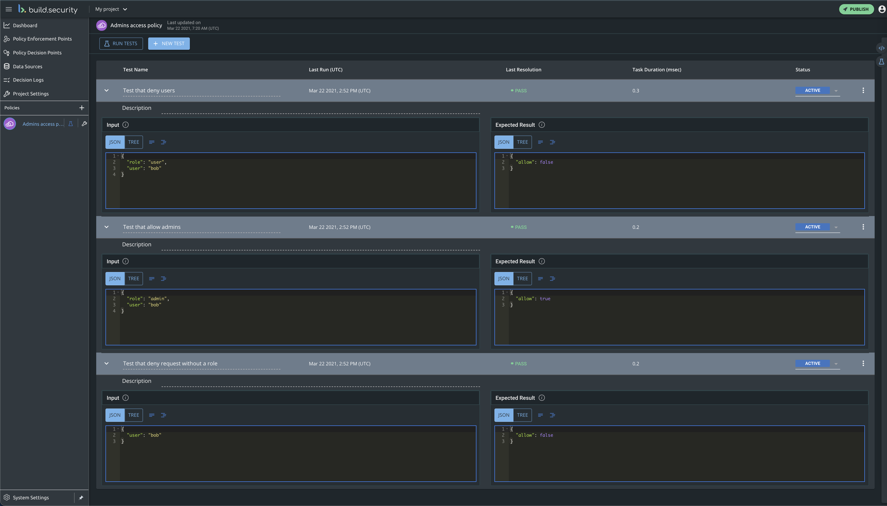
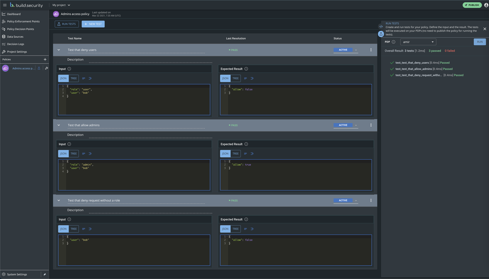
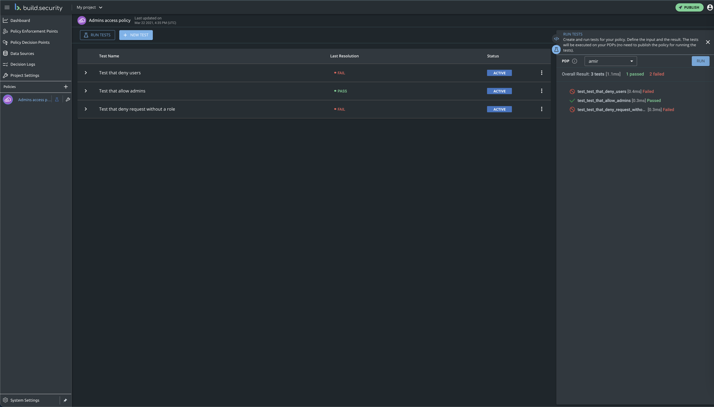

# Policy Unit Testing

## Introduction

The policy testing truly considers your policy-as-code and enables you to write tests for your policies. These tests shall cover common input and results and more importantly - edge cases within your policy that you want to make sure that are never get broken.

**So let's get started...**


The tests evaluation is done on an active real PDP instance. You can [verify](doc:policy-decision-points) that you have an active instance, if not simply [deploy](doc:pdp-implementation) a new Policy Decision Point.


## Our Policy

We will use a simple basic policy which `DENY` access by default and `ALLOW` access to requests where `input.role == "admin".`

## Policy tests example 

We will create 3 tests: 

1. A test that that verifies requests on behalf of `user` role get denied.
2. A test that that verifies requests on behalf of `admin` role get approved.
3. A test that that verifies requests w/o a specific role get denied.

By clicking the "RUN TESTS" button at the top left, a side panel will get opened on the right hand side - providing a preview of all tests that pass/fail.

Upon  policy behavior changes - for example, changing the default behavior of the policy to be `ALLOW` - tests results change as well as couple of the tests above fail.


**Coming soon** 

Tests will run upon every publish request, refusing an option to publish with failing tests.



**Congratulations**

You are ready to start writing tests.

If you will need more help with building your policy tests - feel free to contact us on our [support portal](https://build-security.atlassian.net/servicedesk/customer/portals).


